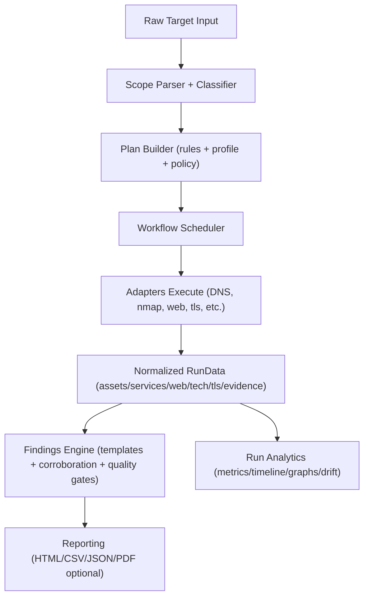

# AttackCastle

AttackCastle is an adaptive external security assessment tool for authorized testing.

At a high level, AttackCastle:

1. Discovers reachable assets and services.
2. Escalates only when evidence supports the next step.
3. Normalizes all evidence into a single model.
4. Generates findings from templates with quality and corroboration gates.
5. Produces report artifacts for executive, client, and technical audiences.

## Contents

- [Legal And Ethical Use](#legal-and-ethical-use)
- [What AttackCastle Does](#what-attackcastle-does)
- [HTTP Proxy Support](#http-proxy-support)
- [Installation](#installation)
- [How To Run](#how-to-run)
- [CLI Guide](#cli-guide)
- [Reporting Model](#reporting-model)
- [Troubleshooting](#troubleshooting)

## Legal And Ethical Use

AttackCastle is for authorized security testing only.

- You must have explicit permission to assess every target.
- Do not run against systems you do not own or have written authorization to test.
- Using AttackCastle implies you accept and will follow these authorization requirements.
- Operators remain responsible for legal and contractual compliance.

## What AttackCastle Does

It combines scope intake, planning, scanning, evidence normalization, findings generation, and reporting in one workflow.

In practical terms, you give AttackCastle a target list and it decides which checks make sense based on what it discovers along the way.

It includes:

- Scope classification and validation.
- Rule-driven planning.
- Adaptive task scheduling with dependency + condition logic.
- Tool adapters (internal + external binaries).
- Normalization and evidence provenance tracking.
- Findings generation with confidence/evidence quality thresholds.
- Report rendering and run analytics.

For example, you can provide mixed scope like:

```text
*.example.com
api.example.com:8443
203.0.113.10
198.51.100.0/24
https://portal.example.com
```

and AttackCastle will automatically choose task paths based on discovered facts while preserving safety budgets and policy constraints.

## Core Adaptive Behavior

The default task chain is:

`subdomain-enum -> resolve-hosts -> check-websites -> run-nmap -> discover-web -> detect-tls/analyze-services -> fingerprint-web -> assess-web/run-nuclei/run-framework-checks/run-sqlmap/run-wpscan -> enrich-cve -> generate-findings -> build-report`

### Example: IP Or CIDR Input

For input like `203.0.113.10` or `203.0.113.0/24`, the workflow reacts like this:

1. `run-nmap` performs scoped port discovery plus service detection in one stage.
2. If HTTP/S candidates are available, `check-websites` runs.
3. Web targets feed `fingerprint-web` (`whatweb`), `assess-web` (`nikto`), and `run-nuclei` (`nuclei`).
4. If form/parameter signals are detected, `run-sqlmap` is scheduled.
5. If WordPress is detected from observations/technologies, `run-wpscan` is scheduled.
6. Service and technology fingerprints feed `enrich-cve`.
7. Findings are generated from normalized evidence.
8. Reports and run analytics are written.

### Example: Wildcard Domain Input

For input like `*.example.com`:

1. Scope classifier marks target as `wildcard_domain`.
2. Domain-like conditions allow DNS and subsequent stages.
3. As assets/services/web entities are discovered, additional tasks unlock.
4. Technology-triggered escalation (for example WordPress) runs only if detected.

### Technology Escalation Matrix (Default)

The default escalation matrix in config enables task escalation based on detected technology:

- `wordpress` -> `run-wpscan`, `run-framework-checks`
- `drupal` -> `run-framework-checks`
- `joomla` -> `run-framework-checks`
- `laravel` -> `run-framework-checks`
- `nextjs` -> `run-framework-checks`

This is reactive behavior by design: work expands only when signals justify expansion.

## HTTP Proxy Support

AttackCastle can route its HTTP-capable traffic through an HTTP(S) proxy such as Burp.

- Configure a default proxy with `proxy.url` in config or `ATTACKCASTLE__PROXY__URL`.
- Override it per run with `attackcastle scan --proxy http://127.0.0.1:8080`.
- Disable configured proxy routing for one run with `attackcastle scan --no-proxy`.
- The same `--proxy` and `--no-proxy` flags are available on `attackcastle plan`.
- The GUI supports the same setting through the profile form and launch summary.

Important limitation:

- Proxy routing applies to AttackCastle HTTP requests, browser screenshot capture, and supported HTTP scanner tools.
- Raw TCP/TLS and socket-based stages such as `nmap`, DNS socket resolution, TLS handshakes, `service_exposure`, and `vhost_discovery` stay direct.

## High-Level Architecture

AttackCastle is a modular monolith with clear boundaries:

- `scope/`: target parsing, classification, filters, validators.
- `orchestration/`: task planning, scheduling, adaptive control flow.
- `adapters/`: scanner/enricher integrations.
- `normalization/`: correlation and graph exports.
- `findings/`: template schema, matcher, engine.
- `reporting/`: view model builders, section plugins, HTML/CSV/JSON/PDF output.
- `storage/`: run directory lifecycle, locks, checkpoints, retention, control files.
- `policy/`: dynamic policy evaluation and task-level decisions.
- `security/`: secret resolution and command redaction support.
- `logging/`: run log + structured audit event stream.

### Execution Flow



## Scope Parsing And Target Types

The parser splits comma/newline input and classifies each token into one of:

- `single_ip`
- `cidr`
- `ip_range`
- `domain`
- `wildcard_domain`
- `url`
- `host_port`
- `asn`
- `unknown`

Examples:

- `203.0.113.10` -> `single_ip`
- `203.0.113.0/24` -> `cidr`
- `203.0.113.10-203.0.113.30` -> `ip_range`
- `example.com` -> `domain`
- `*.example.com` -> `wildcard_domain`
- `https://app.example.com/login` -> `url`
- `api.example.com:8443` -> `host_port`
- `AS13335` -> `asn`

## Task Model And Default Rule Set

Default tasks are declared in `src/attackcastle/orchestration/rules/default_rules.yaml`.

| Task key | Stage | Capability | Condition | Dependencies |
| --- | --- | --- | --- | --- |
| `resolve-hosts` | recon | `dns_resolution` | `has_domain_like_targets` | none |
| `run-nmap` | recon | `network_port_scan` | `has_service_scan_targets` | `resolve-hosts` |
| `check-websites` | enumeration | `web_probe` | `has_web_targets` | `resolve-hosts` |
| `detect-tls` | enumeration | `tls_probe` | `has_tls_targets` | `run-nmap` |
| `fingerprint-web` | enumeration | `web_fingerprint` | `has_web_targets` | `discover-web` |
| `assess-web` | enumeration | `web_vuln_scan` | `has_web_targets` | `discover-web` |
| `run-wpscan` | enumeration | `cms_wordpress_scan` | `has_wordpress_targets` | `discover-web`, `fingerprint-web` |
| `enrich-cve` | analysis | `vuln_enrichment` | `has_enrichment_targets` | `run-nmap`, `fingerprint-web` |
| `generate-findings` | analysis | `findings_engine` | `always` | scan/enrichment tasks |
| `build-report` | output | `reporting` | `always` | `generate-findings` |

### Scheduler Behavior

The scheduler supports:

- Dependency-aware execution.
- Condition-driven waiting and skip transitions.
- Per-task retries with backoff.
- Capability run/runtime budgets.
- Circuit breaker by capability failure count.
- Operator control actions (`pause`, `resume`, `stop`, `skip_task`).
- Checkpointing and resume support.
- Deadlock handling for unresolved dependency graphs.

Matrix-gated tasks that never receive their trigger are safely skipped, so downstream tasks can continue where appropriate.

## Policy Engine

Policy is evaluated per task and can:

- Allow execution.
- Deny/block execution.
- Pause workflow for operator intervention.

Built-in dynamic guards:

- `policy.max_services_discovered`
- `policy.max_errors_before_pause`

Custom rules can be provided inline under `policy.rules` or from `policy.policy_file`.

Example:

```yaml
policy:
  max_services_discovered: 10000
  max_errors_before_pause: 20
  rules:
    - id: "pause_large_web_vuln_scan"
      match:
        capability: "web_vuln_scan"
        profile: "aggressive"
      when:
        min_services: 500
      action: "pause"
      reason: "Manual approval required above 500 services."
```

## Secret Resolution And Redaction

Config values can reference secrets in two forms:

- `env:VAR_NAME`
- `secret://name`

Resolution behavior:

- `env:VAR_NAME` reads `VAR_NAME`.
- `secret://name` reads `ATTACKCASTLE_SECRET_<NAME>` where name is uppercased and `-` becomes `_`.

Examples:

```yaml
wpscan:
  api_token: "env:WPSCAN_API_TOKEN"
```

```yaml
wpscan:
  api_token: "secret://wp_token"
```

The secret resolver also redacts known secret values from command previews/execution strings where integrated.

## Configuration Model

AttackCastle loads config layers in this order:

1. `src/attackcastle/config/default.yaml`
2. `src/attackcastle/config/profiles/<profile>.yaml`
3. Optional user config (`--config`)
4. Environment variable overrides with prefix `ATTACKCASTLE__`

Environment override example:

```bash
ATTACKCASTLE__SCAN__MAX_PORTS=500
ATTACKCASTLE__POLICY__MAX_ERRORS_BEFORE_PAUSE=10
ATTACKCASTLE__WPSCAN__TIMEOUT_SECONDS=600
```

Use config introspection commands:

- `attackcastle config show-effective`
- `attackcastle config explain scan.max_ports`
- `attackcastle config diff --profile-a cautious --profile-b aggressive`
- `attackcastle config simulate --target example.com`

## Profiles

Built-in profiles:

- `cautious`: low-noise, conservative, concurrency 1.
- `standard`: balanced coverage/noise, concurrency 4.
- `aggressive`: higher coverage/noise, concurrency 8.

Profiles tune:

- concurrency
- noise budget
- default adapter args (`nmap`, `whatweb`, `nikto`, `wpscan`)

## Adapter Ecosystem

Current adapters:

- `subdomain_enum` (`subdomain_enumeration`)
- `dns` (`dns_resolution`)
- `nmap` (`network_port_scan`)
- `web_probe` (`web_probe`)
- `tls` (`tls_probe`)
- `whatweb` (`web_fingerprint`)
- `nikto` (`web_vuln_scan`)
- `nuclei` (`web_template_scan`)
- `wpscan` (`cms_wordpress_scan`)
- `sqlmap` (`web_injection_scan`)
- `cve_enricher` (`vuln_enrichment`)

Use:

- `attackcastle plugins list`
- `attackcastle plugins doctor`
- `attackcastle plugins install-missing --yes`

for availability checks.

External binaries are optional but recommended for full coverage:

- `nmap`
- `whatweb`
- `nikto`
- `nuclei`
- `wpscan`
- `sqlmap`

If an external tool is missing, AttackCastle records warnings and continues with available capabilities when possible.
In interactive scans, AttackCastle now prompts to install missing tools with `apt-get`.

## Findings Engine

Findings are generated from templates in:

`src/attackcastle/findings/templates/`

Current templates include:

- `HTTPHeaderMisconfiguration`
- `WeakTLSConfiguration`
- `WordPressExposedVersion`

Engine behavior includes:

- Trigger matching over normalized observations.
- Confidence filtering.
- Corroboration checks (`min_observations`, distinct sources, optional assertions).
- Evidence quality scoring and thresholds.
- Severity overlays by policy.
- Optional suppression file support.
- Candidate vs confirmed classification.

Template docs:

- `docs/template-authoring.md`
- `attackcastle templates list`
- `attackcastle templates validate`

## Reporting Model

Report builder outputs:

- `reports/report.html`
- `reports/services.csv`
- `reports/findings.csv`
- `reports/remediation_plan.csv`
- `reports/asset_exposure_matrix.csv`
- `reports/report_summary.json`
- optional `reports/report.pdf` (if PDF export enabled and dependency available)

Audience modes:

- `executive`
- `client`
- `technical`

Trend features:

- Per-run trend context in report view model.
- Cross-run trend report command:

```bash
attackcastle report trend \
  --run-dir ./output/run_a \
  --run-dir ./output/run_b \
  --output ./output/trend_report.html
```

## Run Persistence, Durability, And Control

Each run creates a durable run directory and includes:

- Locking (`locks/.run.lock`).
- Checkpoints (`checkpoints/*.json`, `checkpoints/manifest.json`).
- Structured audit timeline (`logs/audit.jsonl`).
- Control plane file (`control/control.json`).

Control commands:

```bash
attackcastle run pause --run-dir ./output/run_<id>
attackcastle run continue --run-dir ./output/run_<id>
attackcastle run stop --run-dir ./output/run_<id>
attackcastle run skip-task --run-dir ./output/run_<id> --task-key run-wpscan
```

Additional run operations:

- `attackcastle run status`
- `attackcastle run timeline`
- `attackcastle run dashboard`
- `attackcastle run perf`
- `attackcastle run unlock`
- `attackcastle run resume`

## Distributed Sharding Workflow

AttackCastle supports simple target sharding for parallel worker runs.

1. Build shard plan:

```bash
attackcastle run shard-plan \
  --scope-file ./scope.txt \
  --shards 4 \
  --output ./output/shards.json
```

2. Execute worker for each shard:

```bash
attackcastle run worker \
  --shard-plan ./output/shards.json \
  --shard-id 0 \
  --output-dir ./output \
  --profile standard
```

## Run Artifacts: File-By-File

Typical run tree:

```text
output/
  run_<run_id>/
    artifacts/
      raw/
        <tool_name>/
          ...
    cache/
    checkpoints/
      <task_key>.json
      manifest.json
    control/
      control.json
    data/
      plan.json
      scan_data.json
      run_summary.json
      run_metrics.json
      run_timeline.json
      run_manifest.json
      asset_identity_graph.json
      task_instance_graph.json
      drift_alerts.json
    locks/
      .run.lock
    logs/
      run.log
      audit.jsonl
    reports/
      report.html
      report_summary.json
      services.csv
      findings.csv
      remediation_plan.csv
      asset_exposure_matrix.csv
      assets/
        ...
```

### Important Data Files

- `scan_data.json`: canonical run payload (normalized entities, evidence, findings, facts, task states).
- `plan.json`: explainable task plan + mode/policy/safety metadata.
- `run_summary.json`: compact summary pointers and counts.
- `run_metrics.json`: task status counts, retries, stage and capability duration totals.
- `run_timeline.json`: parsed timeline from audit events.
- `run_manifest.json`: file inventory + SHA256 hashes.
- `asset_identity_graph.json`: entity/relationship graph for asset/service/web/tls/tech linkage.
- `task_instance_graph.json`: task graph with execution and target nodes.
- `drift_alerts.json`: delta analysis vs prior run in output root.

## Installation

Requirements:

- Python 3.12+
- Optional external tools for full scan depth (`nmap`, `whatweb`, `nikto`, `wpscan`)

### Fastest Start For The GUI

If you are running AttackCastle from a source checkout, the easiest way to start is:

```bash
python attackcastlegui.py
```

Run the GUI without `sudo` when you can. If you do start it as root on Kali, the launcher automatically applies QtWebEngine's required Chromium `--no-sandbox` setting before the browser component loads.

That launcher:

- creates a local runtime in `.attackcastle-runtime`
- installs the GUI dependencies automatically
- checks for missing external scanner tools
- launches the GUI

If you only want to verify the GUI bootstrap without opening the app:

```bash
python attackcastlegui.py --check-only
```

If you prefer a manual install, use:

```bash
python -m venv .venv
source .venv/bin/activate
pip install -e ".[gui]"
attackcastle-gui
```

### Debian/APT Install (Repo-backed)

AttackCastle now includes Debian packaging and apt repo helper scripts.
See:

- `docs/debian-packaging-and-repo.md`

for:

- `.deb` build (`./scripts/build-deb.sh`)
- apt repo index generation (`./scripts/build-apt-repo.sh`)
- Kali-side `apt install attackcastle` setup
- desktop launcher packaging and `attackcastle-gui` support after install.

If you just want to test the package locally on Kali before publishing a repo:

```bash
sudo apt install ./../attackcastle_0.1.0-1_all.deb
attackcastle-gui
```

Install in editable mode:

```bash
python -m venv .venv
source .venv/bin/activate
pip install -e .
```

Install dev extras:

```bash
pip install -e ".[dev]"
```

Install missing scanner dependencies via apt:

```bash
attackcastle doctor --install-missing --yes
```

## How To Run

### GUI Workflow (Recommended)

For most people, the GUI is the easiest way to use AttackCastle.

1. Start the GUI:

```bash
python attackcastlegui.py
```

2. Choose or create a workspace when the launcher opens the app.
3. Fill in your target scope, output location, and scan profile in the form.
4. Start the scan from the GUI and monitor progress there.
5. Open the generated report and findings from the GUI once the run completes.

If you already installed the package with GUI support, you can launch it with:

```bash
attackcastle-gui
```

### CLI Workflow

If you prefer the terminal, this is the shortest path:

#### 1) Optional Preflight

```bash
attackcastle doctor \
  --profile cautious \
  --output-dir ./output
```

#### 2) Run Scan

```bash
attackcastle scan \
  --target example.com \
  --output-dir ./output \
  --profile cautious \
  --install-missing
```

#### 3) Inspect Status/Artifacts

```bash
attackcastle run status --output-dir ./output
attackcastle artifacts tree --output-dir ./output
attackcastle findings list --output-dir ./output
```

#### 4) Open Or Rebuild Report

```bash
attackcastle report open --output-dir ./output
attackcastle report rebuild --run-dir ./output/run_<id> --audience technical
```

## CLI Guide

AttackCastle follows a standard command layout:

```text
attackcastle [global-options] <command> [subcommand] [command-options]
```

Start with:

```bash
attackcastle --help
attackcastle <command> --help
attackcastle <command> <subcommand> --help
```

### Global Terminal Options

These apply before the command name and control the terminal experience:

| Option | Purpose |
| --- | --- |
| `--ui-mode operator` | Rich interactive terminal UI for humans. |
| `--ui-mode automation` | Minimal deterministic UI for scripts/CI. |
| `--theme professional|contrast|plain` | Adjust terminal rendering style. |
| `--role operator|manager|qa` | Changes how much operational detail is shown in summaries. |
| `--quiet` | Suppress non-essential text output. |
| `--no-color` | Disable ANSI colors. |
| `--install-completion` | Install completion for the current shell from the root command. |
| `--show-completion` | Print the completion snippet for the current shell. |

Example:

```bash
attackcastle --ui-mode automation --quiet scan --target example.com --output-dir ./output --output-format json
```

### Common Operator Workflow

1. Optionally run preflight checks.
2. Execute the scan.
3. Inspect artifacts, findings, and run health.
4. Open or rebuild the report.

```bash
# 1) Check environment, config, templates, and output path
attackcastle doctor --profile cautious --output-dir ./output

# 2) Execute a scan
attackcastle scan \
  --target example.com \
  --output-dir ./output \
  --profile cautious

# 3) Inspect the latest run
attackcastle run status --output-dir ./output
attackcastle findings triage --output-dir ./output --top 10
attackcastle artifacts tree --output-dir ./output

# 4) Open or rebuild the report
attackcastle report open --output-dir ./output
attackcastle report rebuild --run-dir ./output/run_<id> --audience technical
```

### Command Groups

| Command | What it does | When to use it |
| --- | --- | --- |
| `scan` | Runs a full assessment workflow and writes a new run directory. | Normal day-to-day execution. |
| `guided-scan` | Interactive wizard that collects input and starts a scan. | Manual operator-led runs. |
| `plan` | Advanced preview/debug command for the automatically generated task plan. | Troubleshooting task selection, noise budget, and required tools. |
| `doctor` | Checks Python, dependencies, config loading, templates, DNS, and output directory writability. | Before first use, before CI, or after environment changes. |
| `run` | Inspect, recover, control, or distribute an existing run. | Resume interrupted work, inspect status, or orchestrate workers. |
| `plugins` | Shows scanner/plugin availability and can install missing dependencies. | Dependency visibility and bootstrap. |
| `adapters` | Legacy alias for plugin listing. | Backward-compatible command usage. |
| `templates` | Lists or validates finding templates. | Template QA. |
| `report` | Opens, rebuilds, or trends report outputs across runs. | Delivery and historical comparison. |
| `config` | Explains effective configuration and plan simulation. | Troubleshooting config precedence and plan behavior. |
| `validate` | Validates scope parsing or template schema. | Fast syntax and input checks. |
| `artifacts` | Browses the files written under a run directory. | Post-run investigation and evidence lookup. |
| `findings` | Lists findings, shows template inventory, and builds a triage queue. | Review and QA before delivery. |
| `completion` | Installs shell completion. | CLI ergonomics for bash/zsh/fish. |

### Core Execution Commands

#### Advanced: `attackcastle plan`

Use `plan` when you want to see:

- which tasks are selected or skipped,
- why each task was selected,
- expected noise budget,
- required tools and whether they are installed,
- preview command lines when available,
- safety ceilings such as host and port limits.

Example:

```bash
attackcastle plan \
  --target "*.example.com,203.0.113.10" \
  --output-dir ./output \
  --profile cautious \
  --graph \
  --show-commands
```

#### `attackcastle doctor`

Top-level `doctor` is the environment preflight command. It checks:

- Python version,
- external scanner binaries (`nmap`, `whatweb`, `nikto`, `nuclei`, `wpscan`, `sqlmap`),
- config loading,
- finding template validity,
- DNS reachability,
- output directory writability.

If you are on a Linux/POSIX system, `--install-missing` can attempt an `apt-get` bootstrap for missing tools.

Example:

```bash
attackcastle doctor --profile standard --output-dir ./output --strict
```

#### `attackcastle scan`

`scan` is the main workflow command. It:

- parses target input or a scope file,
- resolves the effective profile and config,
- validates safety ceilings,
- optionally bootstraps missing dependencies,
- builds the workflow plan automatically,
- executes the adaptive workflow,
- writes normalized data, analytics, and reporting artifacts.

Important flags:

| Flag | Meaning |
| --- | --- |
| `--target` / `--scope-file` | Supply inline scope or load it from disk. |
| `--profile` | Choose `prototype`, `cautious`, `standard`, or `aggressive`. |
| `--risk-mode` | Override risk posture with `passive`, `safe-active`, or `aggressive`. |
| `--allow` / `--deny` | Filter parsed scope tokens before execution. |
| `--max-hosts` / `--max-ports` | Tighten safety ceilings for the run. |
| `--dry-run` | Build outputs and plan only, without running scanners. |
| `--json-only` / `--html-only` / `--no-report` | Control output generation mode. |
| `--redact` | Redact sensitive evidence snippets in outputs. |
| `--events-jsonl` | Mirror orchestration events to a machine-readable file. |
| `--resume-run-dir` | Continue from an existing run directory. |
| `--triage` | Show a top findings queue after scan completion. |
| `--non-interactive` | Fail instead of prompting for missing inputs or confirmation. |
| `--yes` | Auto-confirm noisy/aggressive guardrails. |
| `--output-format text|json|ndjson` | Choose human-readable or machine-readable output. |

Automation-friendly example:

```bash
attackcastle --ui-mode automation scan \
  --target "203.0.113.10,https://portal.example.com" \
  --output-dir ./output \
  --profile standard \
  --non-interactive \
  --yes \
  --output-format ndjson
```

### Run Lifecycle And Recovery

The `run` command group operates on an existing run directory.

| Command | Functionality |
| --- | --- |
| `run status` | Shows run summary, metrics, lock state, and pending control action. |
| `run resume` | Restarts an interrupted or paused run using saved checkpoints/context. |
| `run unlock --stale` | Removes a stale lock file if safety checks pass. |
| `run pause` | Writes a control action asking the scheduler to pause. |
| `run continue` | Writes a control action asking the scheduler to resume. |
| `run stop` | Writes a control action asking the scheduler to stop. |
| `run skip-task` | Requests that a specific task key be skipped. |
| `run timeline` | Shows the audit/event timeline from `run_timeline.json` or `logs/audit.jsonl`. |
| `run dashboard` | Displays a live summary of state, duration, retries, findings, and safety data. |
| `run doctor` | Checks run health: summary presence, scan data, checkpoint manifest, lock state, and audit chain integrity. |
| `run perf` | Shows stage and capability duration metrics from `run_metrics.json`. |
| `run shard-plan` | Splits target input into worker shards. |
| `run worker` | Executes a single shard from a shard plan. |
| `run queue-init` / `queue-status` / `queue-claim` / `queue-complete` | Manages a simple file-backed distributed worker queue. |

Examples:

```bash
# Resume the most recent run under ./output
attackcastle run resume --output-dir ./output

# Ask a live run to pause
attackcastle run pause --run-dir ./output/run_<id> --reason operator_requested_pause

# Inspect the audit timeline
attackcastle run timeline --run-dir ./output/run_<id> --limit 50

# Watch a run until it finishes
attackcastle run dashboard --run-dir ./output/run_<id> --follow --interval-seconds 1.0
```

### Reporting, Findings, And Artifacts

These command groups are for post-run review:

| Command | Functionality |
| --- | --- |
| `report open` | Locates the report for a run and optionally launches it in the browser. |
| `report rebuild` | Re-renders reports from `data/scan_data.json` without re-running scanners. |
| `report trend` | Builds an HTML comparison view across multiple runs. |
| `findings list` | Lists findings and supports filtering by status and severity. |
| `findings triage` | Produces a ranked queue using severity, evidence quality, and candidate state. |
| `findings templates` | Alias to `templates list`. |
| `artifacts tree` | Prints the file tree under a run directory. |
| `artifacts find` | Searches artifact paths by substring. |

Examples:

```bash
attackcastle findings list --output-dir ./output --severity high
attackcastle findings triage --output-dir ./output --candidate-only
attackcastle artifacts find --output-dir ./output --query audit
attackcastle report trend --run-dir ./output/run_a --run-dir ./output/run_b --output ./output/trend_report.html
```

### Config, Templates, Validation, And Completion

These commands are mainly for troubleshooting and development:

| Command | Functionality |
| --- | --- |
| `config show-effective` | Shows the final resolved config with source precedence context. |
| `config explain <key>` | Explains where one config key came from across default/profile/user/env/CLI layers. |
| `config diff` | Compares two profiles or config files key by key. |
| `config simulate` | Builds a dry-run plan snapshot for a target/profile pair. |
| `templates list` | Lists bundled finding templates. |
| `templates validate` | Validates bundled finding templates against schema rules. |
| `validate targets` | Parses and validates target input quickly. |
| `validate templates` | Alias to `templates validate`. |
| `plugins list` | Lists registered adapters with capability, cost/noise, and availability. |
| `plugins doctor` | Shows plugin health and missing dependency impact on templates. |
| `plugins install-missing` | Attempts dependency installation using `apt-get` where supported. |
| `completion install` | Installs completion for bash, zsh, or fish. |

Examples:

```bash
attackcastle config explain scan.max_ports
attackcastle config show-effective --profile standard --output-format json
attackcastle config simulate --target example.com --profile cautious
attackcastle templates validate
attackcastle validate targets --target "api.example.com:8443"
attackcastle completion install --shell bash
```

### Working With Existing Runs

Commands that inspect an existing run commonly accept `--run-dir`, `--run-id`, or `--output-dir`.

Resolution rules:

- `--run-dir ./output/run_<id>` uses that exact run directory.
- `--run-id <id> --output-dir ./output` resolves to `./output/run_<id>`.
- `--output-dir ./output` without a run identifier selects the most recent `run_*` directory.
- If `--run-dir` points at the output root instead of a specific run, AttackCastle also tries to select the latest `run_*` folder under it.

This makes the following convenient:

```bash
attackcastle run status --output-dir ./output
attackcastle report open --output-dir ./output
attackcastle findings list --output-dir ./output
```

### Machine-Readable Output And Exit Codes

Most commands support `--output-format text|json|ndjson`.

- `text` is best for operators.
- `json` is best when you want one structured payload at the end.
- `ndjson` is useful for streaming automation and log processors.

Useful automation flags:

- `--ui-mode automation`
- `--quiet`
- `--non-interactive`
- `--yes`

Important exit codes:

| Exit code | Meaning |
| --- | --- |
| `0` | Successful completion. |
| `1` | Internal or unexpected failure. |
| `2` | Validation or input error. |
| `3` | Partial success, warnings, or incomplete run with usable artifacts. |
| `4` | Dependency or preflight failure. |
| `130` | Cancelled run. |

## Input Filtering And Safety

Safety-related features include:

- allow/deny token filters on parsed scope (`--allow`, `--deny`)
- host and port safety ceilings (`max_hosts`, `hard_max_hosts`, `max_ports`, `hard_max_ports`)
- profile noise limits
- capability run/runtime budgets
- retries + retry ceilings
- circuit breaker fail-open protection

### Output Modes

Scan output behavior can be tuned with:

- `--dry-run`: planning only, no scanning execution.
- `--json-only`: machine-focused JSON output path.
- `--html-only`: report-focused output path.
- `--no-report`: skip report build stage.
- `--redact`: redact sensitive evidence snippets.

## Drift, Graphing, And Analytics

AttackCastle includes analysis outputs beyond classic findings:

- Drift alerts compare the current run to the previous run in the same output root.
- Identity graph models relationships among assets/services/web/tls/technologies.
- Task instance graph links task state, tool execution, and scanned targets.
- Metrics summarize retries, status counts, and duration by stage/capability.
- Timeline reconstructs orchestration events from audit logs.

These outputs are useful for:

- regression detection between assessments,
- coverage explanation,
- post-run review and QA,
- executive trend communication.

## Developer And Extension Notes

### Adapter SDK

Adapters follow a straightforward contract:

- input: `AdapterContext`, `RunData`
- output: `AdapterResult`
- metadata: `capability`, `noise_score`, `cost_score`
- optional planner hint: `preview_commands(context, run_data)`

See:

- `docs/adapter-sdk.md`

### Findings Templates

See:

- `docs/template-authoring.md`

### Architecture Notes

See:

- `docs/architecture.md`

## Testing

Run unit/integration tests:

```bash
python -m pytest -q
```

Compile-time sanity check:

```bash
python -m compileall -q src tests
```

## Troubleshooting

### Missing External Tools

Symptom:

- warnings about missing `nmap`, `whatweb`, `nikto`, or `wpscan`.

Action:

- run `attackcastle plugins install-missing --yes`, then re-run `attackcastle plugins doctor`.

### Run Directory Locked

Symptom:

- run cannot start because lock exists.

Action:

```bash
attackcastle run unlock --run-dir ./output/run_<id> --stale --max-age-minutes 30
```

### Unexpected Skipped Tasks

Common causes:

- condition not satisfied (`no web services detected`, etc.)
- escalation matrix trigger not observed
- profile noise policy blocked selection
- capability budget exhausted
- policy rule denied or paused task

Use:

- `attackcastle run timeline`
- `attackcastle run status`
- `attackcastle run perf`
- `data/plan.json` in the run directory

to inspect decision reasons.

## Current Maturity

AttackCastle is a strong MVP with adaptive orchestration and reporting depth.
It is designed for practical authorized external assessment workflows where traceability, explainability, and controlled escalation matter.

## License

MIT (see `LICENSE`).
